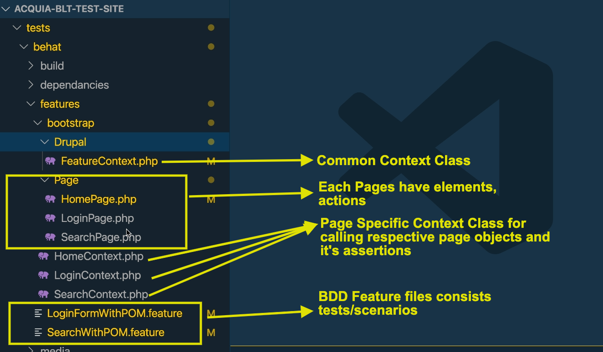
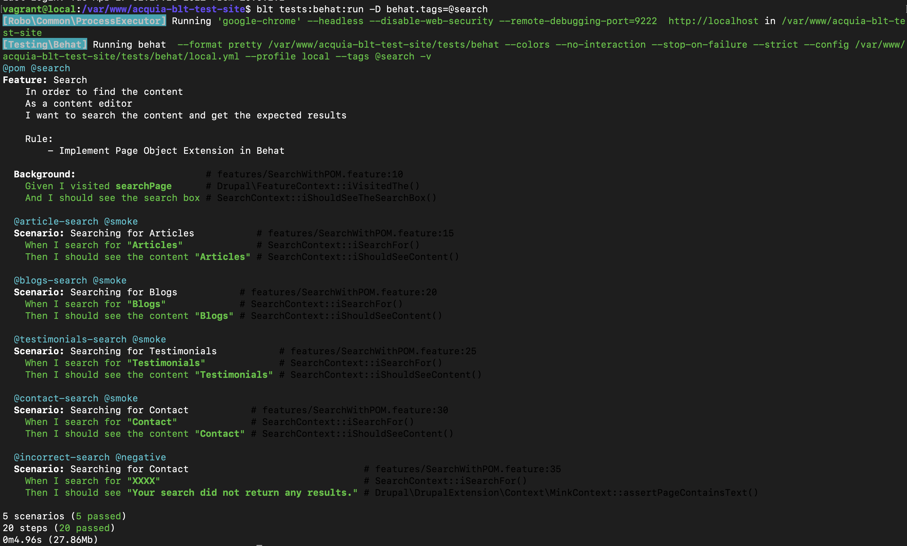

# Implementing Page Object Design Pattern in Behat Test Framework in Acquia BLT Project

## About Project

- This project is based on BLT, an open-source project template and tool that enables building, testing, and deploying Drupal installations following Acquia Professional Services best practices.
- Please refer and follow this [READ ME](/SetUp_README.md) for local setup and workflow.

## Introduction to page objects


**Page object** encapsulates all the dirty details of a user interface.
Instead of messing with the page internals in our context files, we'd
rather ask a page object to do this for us:

    .. code-block:: php

        <?php

        /**
         * @When /^I submit the login form with username "(?P<uname>(?:[^"]|\\")*)" and password "(?P<pwd>(?:[^"]|\\")*)"$/
         */
        public function iSubmitTheLoginFormWithCredentials($uname,$pwd)
        {
           $this->getPage('LoginPage')->iSubmitTheLoginFormWithCredentials($uname,$pwd);
        }

### Advantages Of Using This Method

- **Page objects** hide the UI and expose clean services (like login or search), which can be used in the context classes which leads both the feature file and the Context file are readable and cleaner.
- **Maintenance** becomes exponentially easy. Any changes made to the page, for example adding, modifying or deleting any field on the form needs changes to be made only to the particular class file without touching your test scenarios. The test scenario should be modified only if the test condition has changed.
- **Functions are re-usable** and can be used to test both positive and negative scenarios without having to write any extra code.

## About Automated Tests

- Testing Framework & Extension Details:
  - [behat](https://docs.behat.org/en/latest/)
  - [behat page object extension](https://github.com/sensiolabs/BehatPageObjectExtension)
- Base url of this current project: http://local.acquia-blt-test-site.com
- Features are tagged with the following primary behat tags:
  - @search => Validation of basic search tests
  - @login => Validation of login form tests

### Project Directory Structure



- Features are tagged with the following primary behat tags:
  - @search => Validation of basic search tests
  - @login => Validation of login form tests

### Commands for Test Execution

```
  $ blt tests:behat:run -D behat.tags=@search
  $ blt tests:behat:run -D behat.tags=@login
```

### Test Execution Results



